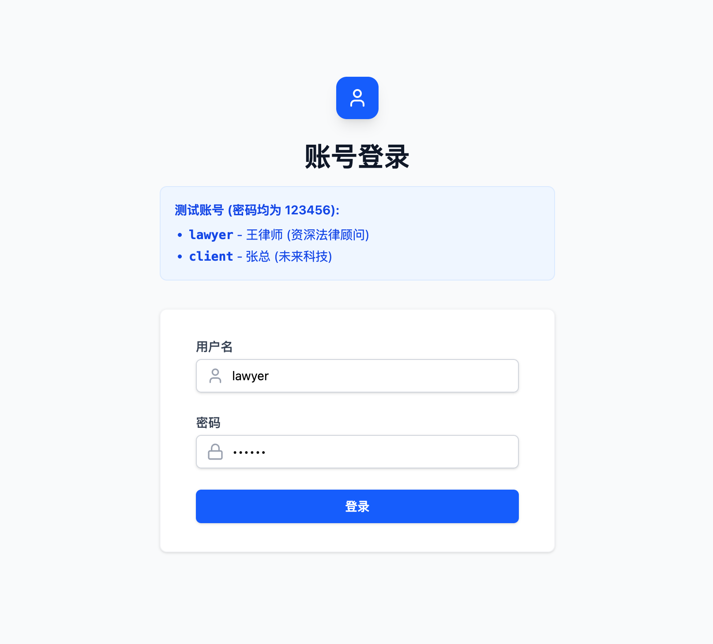
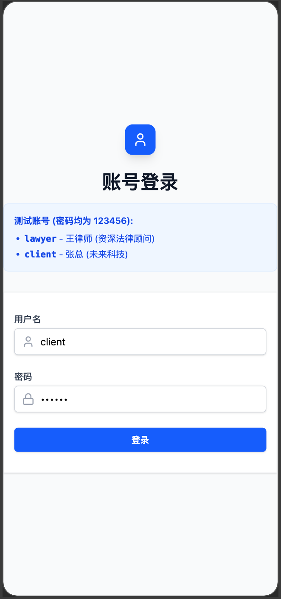

# IM Connect

IM Connect 是一个强大的即时通讯平台，旨在连接**企业**与**行业专家**。它提供了一个无缝的沟通渠道，专为咨询、技术支持和专业协作而量身定制。

## 🚀 功能特性

- **角色系统**: 为**企业**（寻求帮助）和**专家**（提供解决方案）提供独特的工作流和个人资料。
- **实时消息**: 基于 WebSocket 的低延迟聊天。
- **多媒体支持**:
  - 文本、表情符号
  - 图片分享（带预览）
  - 文件附件
- **智能聊天功能**:
  - 消息已读/未读状态
  - 消息撤回（软删除）
  - 未读消息计数
  - 会话置顶
- **用户档案**: 丰富的个人资料管理，包括专业标签、个人简介和组织信息。
- **搜索**: 高效的消息和联系人查找。
- **响应式 UI**: 基于 Tailwind CSS 和 Framer Motion 构建的现代简洁界面。


## 📸 界面预览

<div align="center">
  <h3>登录页面</h3>
  
  
  <p><i>桌面端与移动端登录</i></p>

  <h3>聊天界面</h3>
  
  
  <p><i>实时聊天 (响应式设计)</i></p>
  
  <h3>用户主页</h3>
  
  
  <p><i>用户与专家详情页</i></p>
</div>

## 🛠 技术栈

### 前端 (Frontend)
- **核心**: [React 19](https://react.dev/)
- **构建工具**: [Vite](https://vitejs.dev/)
- **样式**: [Tailwind CSS v4](https://tailwindcss.com/)
- **状态与路由**: React Router DOM, Custom Hooks.
- **图标**: Lucide React.
- **动画**: Framer Motion.

### 后端 (Backend)
- **运行环境**: [Node.js](https://nodejs.org/)
- **服务端框架**: [Express.js](https://expressjs.com/)
- **实时通信**: [ws](https://github.com/websockets/ws) (WebSocket)
- **数据库**: SQLite (开发环境) / 兼容 PostgreSQL/MySQL.
- **ORM**: [Prisma](https://www.prisma.io/)
- **对象存储**: 支持本地存储和阿里云 OSS。

## 🏁 快速开始

按照以下说明在本地机器上运行项目。

### 前置要求

- **Node.js**: v18 或更高版本
- **包管理器**: [pnpm](https://pnpm.io/) (推荐) 或 npm

### 安装步骤

1. **克隆仓库**
   ```bash
   git clone https://github.com/7-ch/im-connect.git
   cd im-connect
   ```

2. **安装依赖**
   ```bash
   pnpm install
   ```

3. **环境配置**
   在根目录创建一个 `.env` 文件。你可以参考以下配置：
   ```env
   # 数据库
   DATABASE_URL="file:./dev.db"

   # 服务器
   PORT=8080

   
   # 对象存储 (可选 - 如果未设置则默认为本地文件系统)
   OSS_REGION=
   OSS_ACCESS_KEY_ID=
   OSS_ACCESS_KEY_SECRET=
   OSS_BUCKET=
   ```

4. **数据库设置**
   生成 Prisma 客户端并将 Schema 推送至数据库。
   ```bash
   pnpm db:migrate
   ```

5. **填充数据 (可选)**
   使用初始用户和会话数据填充数据库以便测试。
   ```bash
   pnpm db:seed
   ```

### 运行应用

你可以分别运行前端和后端。

**1. 启动后端服务器**
```bash
node server.js
```
> 服务器将在端口 `8080` (或你配置的端口) 上启动。

**2. 启动前端开发服务器**
```bash
pnpm dev
```
> 应用程序可以通过 `http://localhost:5173` 访问。

## 📂 项目结构

```bash
├── src/                # 前端应用
│   ├── components/     # 可复用 UI 组件 (ChatBubble, ContactList, etc.)
│   ├── pages/          # 主要路由页面 (Login, Chat, etc.)
│   ├── hooks/          # 自定义 React hooks (useAuth, usesSocket, etc.)
│   ├── utils/          # 前端工具函数
│   └── assets/         # 静态资源
├── server/             # 后端应用
│   ├── routes/         # Express API 路由
│   ├── socket.js       # WebSocket 事件处理
│   └── seed.js         # 数据库填充逻辑
├── prisma/             # 数据库 Schema 和迁移
├── public/             # 公共静态文件
└── scripts/            # 实用脚本
```

## 📜 关键脚本

- `pnpm dev`: 启动前端开发服务器。
- `pnpm build`: 构建生产环境前端代码。
- `pnpm db:studio`: 打开 Prisma Studio 查看/编辑数据库记录。
- `pnpm db:reset`: 重置数据库 (警告: 会删除所有数据)。


## 🚢 部署

详细的部署说明请参考 [DEPLOY_CN.md](./DEPLOY_CN.md)。

我们提供了一个便捷的 Shell 脚本来自动化部署流程：

```bash
./scripts/deploy.sh
```

## 🤝 贡献

1. Fork 本项目
2. 创建你的特性分支 (`git checkout -b feature/AmazingFeature`)
3. 提交你的更改 (`git commit -m 'Add some AmazingFeature'`)
4. 推送到分支 (`git push origin feature/AmazingFeature`)
5. 打开 Pull Request

## 📄 许可证

根据 MIT 许可证分发。查看 `LICENSE` 了解更多信息。
